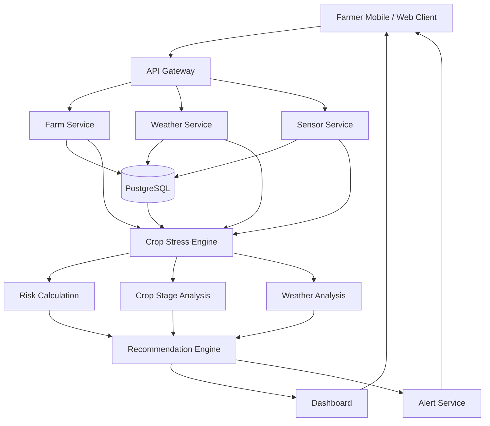
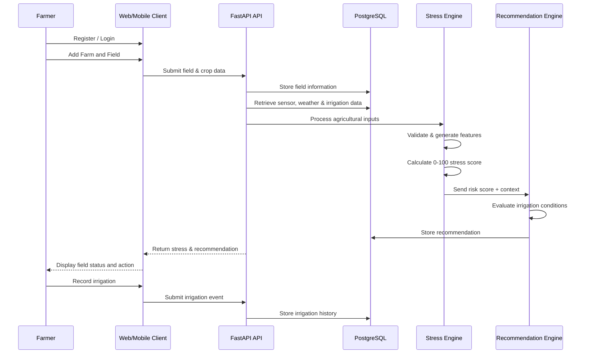

# AgriNova

### AI-Powered Crop Water-Stress Monitoring & Irrigation Decision-Support Platform

AgriNova is an AI-powered precision-agriculture platform designed to detect crop water-stress risk early and convert agricultural, environmental, and irrigation data into simple, field-specific irrigation decisions.

Instead of relying on fixed irrigation schedules, AgriNova moves toward **condition-based irrigation**: understanding whether a crop is likely to experience water stress and helping the farmer decide what action to take.

> **Core idea:** From “Water the field every two days” → to “Water this field only when the crop actually needs it.”

---

## Table of Contents

- [Problem](#problem)
- [Solution](#solution)
- [Key Features](#key-features)
- [How It Works](#how-it-works)
- [System Architecture](#system-architecture)
- [MVP Scope](#mvp-scope)
- [Technology Stack](#technology-stack)
- [Database Schema](#database-schema)
- [Crop Water-Stress Engine](#crop-water-stress-engine)
- [Recommendation Logic](#recommendation-logic)
- [Application Workflow](#application-workflow)
- [API Structure](#api-structure)
- [Sensor & Weather Integration](#sensor--weather-integration)
- [Security & Reliability](#security--reliability)
- [Project Structure](#project-structure)
- [Implementation Roadmap](#implementation-roadmap)
- [Future Roadmap](#future-roadmap)
- [Business Model](#business-model)
- [MVP Definition of Done](#mvp-definition-of-done)
- [Live Demo](#live-demo)
- [License](#license)

---

## Problem

Crop water stress can develop before visible symptoms such as leaf wilting appear. Conventional irrigation practices frequently depend on:

- Fixed irrigation schedules
- Manual soil inspection
- Farmer intuition
- Visible crop symptoms
- General weather forecasts
- Uniform irrigation across an entire field

These approaches can lead to:

- Over-irrigation
- Under-irrigation
- Water wastage
- Increased pumping and energy costs
- Waterlogging
- Reduced crop growth and yield potential
- Lack of localized field intelligence

AgriNova addresses this gap by combining **crop information, soil moisture, weather conditions, irrigation history, and decision intelligence** to estimate crop water-stress risk and provide actionable recommendations.

---

## Solution

AgriNova provides a crop-centric irrigation intelligence layer between the field and the irrigation decision.

The platform aims to answer:

> **“Is my crop becoming water-stressed, what is causing the risk, and what should I do now?”**

The MVP is intentionally positioned as an **early crop water-stress detection and irrigation decision-support system**, rather than a fully autonomous smart-farm platform.

---

## Key Features

### 1. Farmer & Farm Management

Farmers can:

- Register and authenticate
- Create farms
- Create and manage fields
- Record crop information
- Specify soil type
- Record planting date
- Specify irrigation method

### 2. Field Dashboard

The dashboard provides a field-level view of:

- Crop water-stress score
- Soil moisture
- Temperature
- Humidity
- Rainfall
- Weather forecast
- Last irrigation
- Recommended irrigation
- Current field status
- Crop growth stage

### 3. Crop Water-Stress Score

AgriNova generates a normalized **0–100 Crop Water Stress Risk Score**.

Example:

```text
24 / 100 → Low Risk
78 / 100 → High Risk
```

The MVP uses a weighted/rule-based approach rather than requiring a complex deep-learning model.

### 4. Actionable Irrigation Recommendations

Instead of exposing raw sensor values as the primary output, AgriNova converts the available information into a simple recommendation.

Example:

```text
Water-stress risk is increasing.

Why?
Soil moisture is low, temperatures are high,
and significant rainfall is not expected.

Recommended action:
Irrigate within the next 12 hours.
```

### 5. Early-Warning Alerts

The system can generate alerts for:

- Increasing water-stress risk
- Required irrigation
- Expected rainfall
- Stale or unavailable sensor data

### 6. Weather Integration

Weather information can include:

- Temperature
- Humidity
- Rainfall
- Forecast rainfall
- Forecast temperature
- Wind conditions where available

Weather forecasts are considered when generating irrigation recommendations so that irrigation is not unnecessarily recommended immediately before meaningful rainfall.

### 7. Irrigation History

Farmers can record:

- Date/time
- Field
- Irrigation duration
- Estimated water quantity
- Irrigation method

Historical irrigation data can then be used by the decision engine.

### 8. Field History

AgriNova can maintain historical information about:

- Stress events
- Irrigation events
- Soil-moisture trends
- Weather trends
- Recommendations
- Alerts

### 9. Basic Water-Use Analytics

The MVP provides simple water-use insights and establishes the foundation for future water-saving analytics.

### 10. Mobile-First Experience

The interface prioritizes:

- Large, readable information
- Minimal technical terminology
- Clear status indicators
- Simple recommendations
- Mobile-first usability

---

## How It Works



The architecture is modular so that future AI, satellite, IoT, and predictive analytics capabilities can be introduced without rebuilding the core platform.

---

## System Architecture

The technical architecture consists of the following major layers:

| Layer | Responsibility |
|---|---|
| Farmer Client | Mobile/web interaction, dashboard, alerts and recommendations |
| API Gateway | Central entry point for backend APIs |
| Farm Service | Farm and field management |
| Weather Service | Weather data retrieval and normalization |
| Sensor Service | Sensor/simulated data ingestion |
| Crop Stress Engine | Risk calculation, crop-stage analysis and weather analysis |
| Recommendation Engine | Converts risk and context into an actionable recommendation |
| Alert Service | Generates threshold-based warnings |
| PostgreSQL | Persistent agricultural and application data |

### Core Technical Loop

```text
Field Data
    ↓
Data Processing
    ↓
Crop Water-Stress Analysis
    ↓
Risk Score
    ↓
Recommendation
    ↓
Farmer Alert
    ↓
Irrigation Record
    ↓
Historical Analysis
```

The central technical objective is to turn heterogeneous agricultural data into an interpretable irrigation decision.

---

## MVP Scope

The MVP focuses on the following capabilities:

- Farmer registration and authentication
- Farm and field management
- Crop information
- Soil-moisture monitoring
- Weather integration
- Crop water-stress risk calculation
- Field-condition classification
- Irrigation recommendations
- Early-warning alerts
- Irrigation history
- Field history
- Basic water-use insights
- Mobile-first dashboard

### Explicitly Out of Scope for MVP

The MVP does **not** require:

- Fully autonomous irrigation
- Drone integration
- Advanced satellite analytics
- Hardware manufacturing
- Complex computer vision
- Yield prediction
- Fertilizer recommendation
- Pest detection
- Autonomous farm machinery

These are future extensions rather than MVP requirements.

---

## Technology Stack

### Frontend

- React.js / Next.js
- Responsive, mobile-first UI
- Dashboard components
- Field visualization
- Alerts
- Recommendations
- Historical charts

### Backend

- Python
- FastAPI
- REST APIs
- Authentication and authorization
- Farm/field management
- Sensor ingestion
- Weather integration
- Stress calculation
- Recommendation generation
- Alert generation
- Analytics APIs

### Database

- PostgreSQL

### AI / Decision Engine

- Python-based rule-based/weighted decision engine for MVP
- Designed for future machine-learning and hybrid AI upgrades

### Sensor Communication

- REST API
- MQTT
- Optional ESP32 integration

### Infrastructure

- Docker
- Cloud-hosted architecture
- Google Cloud Platform deployment direction
- Managed PostgreSQL
- Google Cloud Run for containerized backend deployment

---

## Database Schema

The PostgreSQL model is organized into four logical areas:

### User & Farm Management

```text
users
 └── farms
      └── fields
```

### Agricultural Data

```text
crops
 └── crop_growth_stages

fields
 └── irrigation_events
```

### Environmental & Sensor Data

```text
fields
 └── sensors
      └── sensor_readings

fields
 └── weather_records
```

### Intelligence & Outputs

```text
fields
 └── stress_scores
      └── recommendations

fields
 └── alerts
```

### Primary Entities

| Entity | Purpose |
|---|---|
| `users` | Farmer/user accounts |
| `farms` | Registered farms |
| `fields` | Individual agricultural fields |
| `crops` | Crop and variety information |
| `crop_growth_stages` | Crop-stage information |
| `sensors` | Field sensor/device information |
| `sensor_readings` | Sensor measurements |
| `weather_records` | Current and forecast weather information |
| `irrigation_events` | Historical irrigation events |
| `stress_scores` | Calculated water-stress risk |
| `recommendations` | Generated irrigation recommendations |
| `alerts` | Farmer-facing alerts |

---

## Crop Water-Stress Engine

The MVP uses a weighted/rule-based model.

The stress calculation considers:

- Soil-moisture deficit
- Temperature stress
- Recent rainfall
- Forecast rainfall
- Crop growth stage
- Irrigation history
- Crop information

Conceptually:

```text
Stress Risk =
    Soil Moisture Component
  + Temperature Component
  + Weather Component
  + Crop Stage Component
  + Irrigation History Component
```

The resulting score is normalized to a range of **0–100**.

### Risk Classification

| Score | Risk Level |
|---:|---|
| 0–30 | Low |
| 31–50 | Moderate |
| 51–70 | Elevated |
| 71–85 | High |
| 86–100 | Critical |

The exact weights are intended to be calibrated using agricultural literature, agronomist validation, and eventually real farm data.

---

## Recommendation Logic

The recommendation engine considers both current field conditions and near-term weather.

### Example: Irrigation Required

```text
IF stress risk is high
AND soil moisture is low
AND expected rainfall is low

THEN
    recommend irrigation
```

### Example: Delay Irrigation

```text
IF stress risk is moderate
AND significant rainfall is expected

THEN
    recommend waiting and monitoring
```

### Example: Data Quality Warning

```text
IF sensor data is stale

THEN
    flag data-quality warning
```

A recommendation should not be generated from a single sensor value.

### Recommendation Confidence

Recommendations can include a confidence score based on:

- Data freshness
- Number of available inputs
- Sensor reliability
- Weather confidence
- Crop-information completeness

This allows uncertain predictions to be represented as uncertain rather than absolute facts.

---

## Field Status Indicators

The MVP defines four user-facing field states:

| Status | Meaning |
|---|---|
| Green — Healthy | Low water-stress risk |
| Yellow — Watch | Water-stress risk is increasing |
| Orange — Action Recommended | Irrigation should be considered soon |
| Red — High Stress Risk | Immediate irrigation assessment is recommended |

---

## Application Workflow



---

## Data Processing Pipeline

### Step 1 — Data Collection

Inputs include:

- Soil moisture
- Temperature
- Humidity
- Rainfall
- Weather forecast
- Crop information
- Irrigation history

### Step 2 — Data Validation

The backend checks for:

- Missing values
- Invalid values
- Sensor freshness
- Outlier measurements

### Step 3 — Feature Generation

Derived features can include:

- Soil-moisture deficit
- Temperature stress
- Recent rainfall
- Forecast rainfall
- Time since irrigation
- Crop growth stage

### Step 4 — Stress Calculation

The Crop Stress Engine produces the 0–100 risk score.

### Step 5 — Recommendation

The Recommendation Engine converts the risk score and contextual information into an irrigation action.

### Step 6 — Alert

When the risk crosses a configured threshold, an alert can be generated.

---

## API Structure

The backend API is organized around authentication, farms, fields, sensors, stress analysis, recommendations, irrigation, and alerts.

### Authentication

```text
POST /api/auth/register
POST /api/auth/login
GET  /api/auth/me
```

### Farms

```text
GET    /api/farms
POST   /api/farms
GET    /api/farms/{id}
PUT    /api/farms/{id}
DELETE /api/farms/{id}
```

### Fields

```text
GET    /api/fields
POST   /api/fields
GET    /api/fields/{id}
PUT    /api/fields/{id}
DELETE /api/fields/{id}
```

### Sensors

```text
POST /api/sensors/readings
GET  /api/fields/{id}/sensor-data
```

### Stress

```text
GET /api/fields/{id}/stress
GET /api/fields/{id}/stress/history
```

### Recommendations

```text
GET /api/fields/{id}/recommendation
```

### Irrigation

```text
POST /api/fields/{id}/irrigation
GET  /api/fields/{id}/irrigation/history
```

### Alerts

```text
GET  /api/alerts
POST /api/alerts/{id}/acknowledge
```

---

## Sensor & Weather Integration

Hardware remains optional in the MVP.

### Mode A — Simulated / Manual Data

Useful for:

- Hackathons
- Prototypes
- Demonstrations
- Early development

### Mode B — Real Sensors

Potential sensors include:

- Capacitive soil-moisture sensor
- Temperature sensor
- Humidity sensor

An ESP32 can transmit readings to the AgriNova backend.

```text
ESP32
  ↓
Wi-Fi / Cellular
  ↓
AgriNova API
  ↓
PostgreSQL
  ↓
Crop Stress Engine
```

### Weather Pipeline

```text
Weather API
    ↓
Normalization
    ↓
weather_records
    ↓
Recommendation Engine
```

---

## Security & Reliability

The backend architecture includes defensive security requirements such as:

- JWT or secure session-based authentication
- Password hashing
- HTTPS
- Input validation
- Rate limiting
- Authentication middleware
- Authorization checks
- Protected farmer data
- Farm/field ownership checks

### Sensor Reliability

Sensor failures should not result in incorrect irrigation recommendations.

The system should detect:

- Missing readings
- Abnormally constant readings
- Sudden impossible values
- Offline sensors
- Stale sensor data

When important data is unavailable, recommendation confidence should be reduced.

---

## Project Structure

The implementation plan recommends a monorepo structure:

```text
agrinova-workspace/
├── frontend/
├── backend/
├── database/
├── infrastructure/
└── docs/
```

A frontend structure can follow:

```text
frontend/
└── src/
    ├── components/
    ├── pages/
    ├── layouts/
    ├── services/
    ├── hooks/
    ├── charts/
    ├── maps/
    ├── auth/
    └── utils/
```

Important UI components include:

```text
FieldStatusCard
StressScoreCard
IrrigationRecommendation
WeatherCard
SoilMoistureChart
AlertPanel
FieldMap
IrrigationHistory
FarmSelector
```

---

## Implementation Roadmap

The implementation plan is organized into six phases.

### Phase 1 — Workspace & Artifact Initialization

- Initialize monorepo
- Organize frontend, backend, database, infrastructure and documentation
- Use the PRD, TRD and Business Model Canvas as bounded project context
- Keep the implementation focused on MVP requirements

### Phase 2 — Backend & Database

- Build PostgreSQL schema
- Implement FastAPI API Gateway
- Implement Farm Service
- Implement Weather Service
- Implement Sensor Service
- Add Docker configuration

### Phase 3 — Intelligence Layer

- Implement rule-based Crop Stress Engine
- Implement 0–100 risk scoring
- Implement Recommendation Engine
- Keep the intelligence layer decoupled for future AI/ML upgrades

### Phase 4 — Defensive Security & Validation

- Implement JWT validation
- Validate API routing
- Apply input and access-control validation
- Configure secure caching behavior
- Monitor API access patterns

### Phase 5 — Frontend

- Build mobile-first dashboard
- Implement field-status visualization
- Integrate stress score
- Add weather and soil-moisture visualizations
- Add alerts
- Connect frontend to FastAPI backend

### Phase 6 — Deployment & Operations

- Deploy managed PostgreSQL
- Containerize FastAPI
- Deploy backend using Cloud Run
- Deploy the frontend
- Add application and API monitoring
- Monitor sensor uptime and alert engagement

---

## Future Roadmap

AgriNova is designed to evolve beyond the MVP.

### Phase 1 — MVP

```text
Rule-Based + Weighted Scoring
```

### Phase 2 — Machine Learning

```text
Historical Farm Data
        ↓
ML Prediction
        ↓
Improved Stress Forecasting
```

### Phase 3 — Remote Sensing

Future satellite integration can use:

- NDVI
- NDWI
- Vegetation indices
- Land-surface temperature

Potential pipeline:

```text
Satellite Image
      ↓
Image Processing
      ↓
Vegetation / Water Indices
      ↓
Field-Level Features
      ↓
Stress Model
      ↓
Water-Stress Map
```

### Phase 4 — Predictive Water-Stress Forecasting

The system can evolve toward predictions such as:

```text
“This field is likely to enter high
water-stress conditions within the next 24–48 hours.”
```

### Phase 5 — Precision Irrigation Automation

Future integrations can include:

- Smart pumps
- Solenoid valves
- IoT irrigation controllers

The long-term product evolution is:

```text
Layer 1 — Data Collection
        ↓
Layer 2 — Crop Water-Stress Intelligence
        ↓
Layer 3 — Predictive Water-Stress Forecasting
        ↓
Layer 4 — Precision Irrigation Automation
```

The MVP establishes the first two layers.

---

## Business Model

AgriNova's primary value proposition is:

> **Detect crop water stress early and tell farmers when irrigation is actually needed.**

The product is positioned between traditional irrigation, sensor-driven smart irrigation, and advanced but technically complex agritech solutions.

### Target Customers

- Small farmers
- Medium-sized farmers
- Irrigated farms
- Water-constrained agricultural regions
- Farmer Producer Organizations
- Agricultural consultants
- Large farms
- Agricultural cooperatives
- Agritech companies
- Agricultural institutions

### Revenue Model

Potential revenue streams defined for the product include:

#### Freemium

**Basic**

- One field
- Basic monitoring
- Basic alerts

**Premium**

- Multiple fields
- Advanced analytics
- Predictive alerts
- Historical trends
- Water-use optimization

#### B2B Subscription

Pricing can be based on:

- Number of farms
- Number of fields
- Number of monitored hectares

#### Hardware + Software

Future model:

```text
Sensor Package + AgriNova Subscription
```

#### Enterprise / API

Potential API customers include:

- Agritech companies
- Irrigation companies
- Agricultural platforms
- Research organizations

---

## Product Moat

AgriNova's long-term competitive advantage is intended to be a continuously improving crop water-stress intelligence layer built from field-specific historical data.

As the platform collects:

- Crop conditions
- Soil behavior
- Weather patterns
- Irrigation events
- Stress events
- Farmer responses

it can progressively improve models for specific:

- Crops
- Regions
- Soil types
- Climate conditions
- Growth stages

This creates a potential data-network effect:

```text
More Fields
    ↓
More Agricultural Data
    ↓
Better Models
    ↓
Better Recommendations
    ↓
More Farmer Value
    ↓
More Fields
```

---

## MVP KPIs

### Product Metrics

- Registered farms
- Monitored fields
- Daily active farmers
- Alert engagement rate
- Recommendation acceptance rate

### Agricultural Metrics

- Reduction in irrigation events
- Estimated water saved
- Reduction in water-stress incidents
- Irrigation efficiency
- Crop-health improvement

### Business Metrics

- Farmer retention
- Subscription conversion
- Cost per monitored field
- Revenue per farm

---

## MVP Definition of Done

The MVP is complete when a farmer can:

- [x] Register
- [x] Add a field
- [x] Select a crop
- [x] Provide or receive soil and weather data
- [x] View current crop water-stress risk
- [x] Understand why the risk exists
- [x] Receive an irrigation recommendation
- [x] Receive an early warning
- [x] Record irrigation
- [x] View historical field conditions

---

## Live Demo

**AgriNova Web Application:**  
https://agrinova-gg7zcg9n.manus.space

---

## Project Documentation

The project is defined and guided by the following documents:

- Product Requirements Document (PRD)
- Technical Requirements Document (TRD)
- Business Model Canvas (BMC)
- MVP Implementation Plan
- Backend PostgreSQL schema
- System architecture and product workflow diagrams

---

## Project Status

**Project:** AgriNova  
**Category:** AI-Powered Precision Agriculture / Smart Irrigation  
**Target:** MVP  
**Architecture:** Web/Mobile Client → API Gateway → Services → Crop Stress Engine → Recommendation Engine → PostgreSQL  
**Decision Model:** Rule-based / weighted scoring for MVP  
**Future Intelligence:** Machine Learning → Remote Sensing → Predictive Stress Forecasting → Precision Irrigation Automation

---


